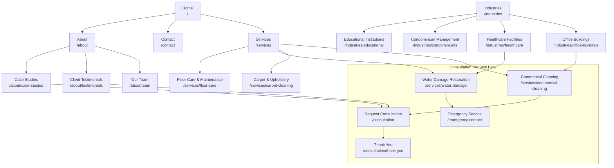

# User Flow — Classic 8 Cleaning Website

```mermaid
graph TD
  %% Primary Pages (accessible from main navigation)
  Home["Home<br/>/"]
  Services["Services<br/>/services"]
  Industries["Industries<br/>/industries"]
  About["About<br/>/about"]
  Contact["Contact<br/>/contact"]

  %% Home page navigation paths
  Home --> Services
  Home --> Contact
  Home --> About

  %% Services detail pages
  Services --> CommercialCleaning["Commercial Cleaning<br/>/services/commercial-cleaning"]
  Services --> CarpetCleaning["Carpet & Upholstery<br/>/services/carpet-cleaning"]
  Services --> WaterDamage["Water Damage Restoration<br/>/services/water-damage"]
  Services --> FloorCare["Floor Care & Maintenance<br/>/services/floor-care"]

  %% Industries detail pages
  Industries --> OfficeBuildings["Office Buildings<br/>/industries/office-buildings"]
  Industries --> Healthcare["Healthcare Facilities<br/>/industries/healthcare"]
  Industries --> CondoManagement["Condominium Management<br/>/industries/condominiums"]
  Industries --> Educational["Educational Institutions<br/>/industries/educational"]

  %% Core Business Features (consultation request flow)
  subgraph "Consultation Request Flow"
    CommercialCleaning --> ConsultationForm["Request Consultation<br/>/consultation"]
    WaterDamage --> EmergencyContact["Emergency Service<br/>/emergency-contact"]
    ConsultationForm --> ThankYou["Thank You<br/>/consultation/thank-you"]
  end

  %% Secondary pages from About
  About --> TeamStory["Our Team<br/>/about/team"]
  About --> Testimonials["Client Testimonials<br/>/about/testimonials"]
  About --> CaseStudies["Case Studies<br/>/about/case-studies"]

  %% Cross-page navigation (key conversion paths)
  OfficeBuildings --> CommercialCleaning
  Healthcare --> WaterDamage
  CaseStudies --> ConsultationForm
  Testimonials --> ConsultationForm
```